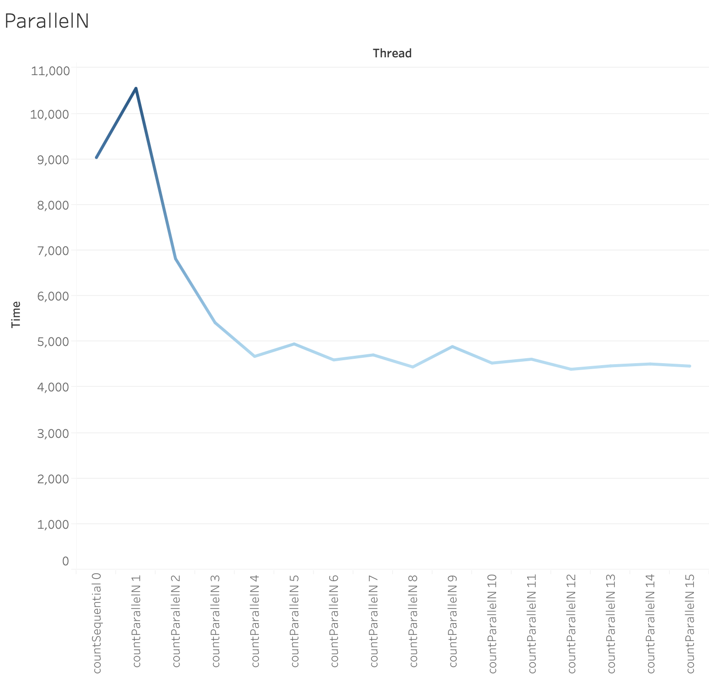
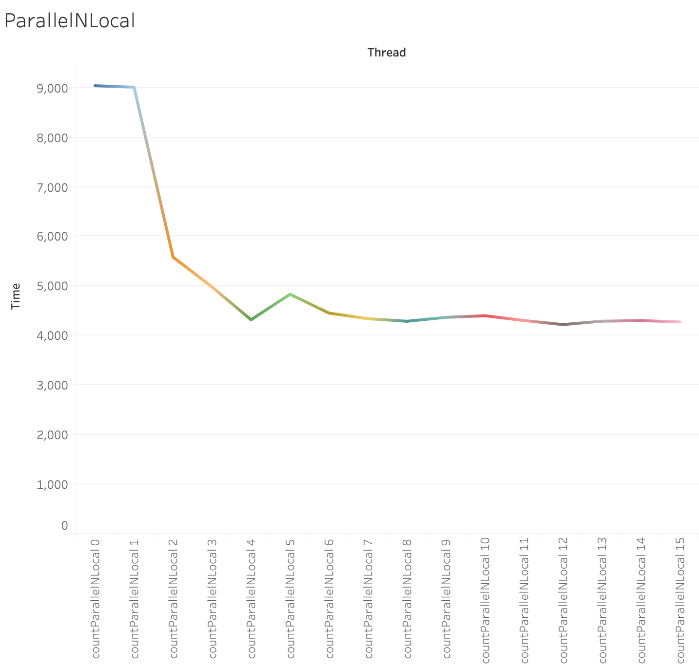

## Exercise 3.1
1. OS:   Mac OS X; 10.14.6; x86_64
  
   JVM:  Oracle Corporation; 11.0.2
   
   CPU:  2,6 GHz Intel Core i7; 8 "cores"
   
   Date: 2019-09-15T13:48:31+0200
   
   **Result: **
   
   Mark0
   3627,0 ns
   
   Mark1
      0,0 ns
   Mark2
     25,6 ns
   Mark3
     25,1 ns
     27,6 ns
     26,3 ns
     25,6 ns
     25,6 ns
     27,1 ns
     27,5 ns
     27,0 ns
     24,4 ns
     24,5 ns
   Mark4
     26,3 ns +/-  0,993
   Mark5
    114,6 ns +/-    89,82          2
     66,1 ns +/-    32,24          4
     46,9 ns +/-    14,30          8
     38,6 ns +/-     6,92         16
     36,9 ns +/-     8,77         32
     35,7 ns +/-    15,38         64
     30,7 ns +/-     3,93        128
     30,0 ns +/-     2,05        256
     31,9 ns +/-     8,41        512
     32,7 ns +/-     7,73       1024
     74,5 ns +/-   145,08       2048
     30,7 ns +/-     4,84       4096
     28,6 ns +/-     4,01       8192
     27,0 ns +/-     0,37      16384
     26,0 ns +/-     2,58      32768
     26,8 ns +/-     1,82      65536
     24,3 ns +/-     0,45     131072
     25,7 ns +/-     0,38     262144
     24,5 ns +/-     0,66     524288
     24,2 ns +/-     0,19    1048576
     24,9 ns +/-     0,76    2097152
     25,1 ns +/-     1,19    4194304
     24,4 ns +/-     0,36    8388608
     25,1 ns +/-     0,71   16777216
   Mark6
   multiply                            428,1 ns     998,27          2
   multiply                            100,2 ns      46,73          4
   multiply                            105,5 ns      67,20          8
   multiply                             82,3 ns      26,99         16
   multiply                             96,0 ns      56,27         32
   multiply                             50,0 ns      24,87         64
   multiply                             39,8 ns       3,71        128
   multiply                             38,9 ns       1,85        256
   multiply                             39,3 ns       4,10        512
   multiply                             35,7 ns       0,55       1024
   multiply                             35,5 ns       0,23       2048
   multiply                             35,5 ns       0,38       4096
   multiply                             28,0 ns       0,98       8192
   multiply                             27,6 ns       0,02      16384
   multiply                             27,4 ns       0,69      32768
   multiply                             28,2 ns       1,81      65536
   multiply                             25,5 ns       0,34     131072
   multiply                             25,5 ns       0,21     262144
   multiply                             24,8 ns       0,83     524288
   multiply                             24,7 ns       0,87    1048576
   multiply                             24,9 ns       0,62    2097152
   multiply                             25,3 ns       1,23    4194304
   multiply                             24,2 ns       0,06    8388608
   multiply                             24,5 ns       0,52   16777216
   
   **Comments: ** Some of them are not reliable. There are several unexpected results. Like in mark5, 74,5 ns +/-   145,08       2048 shows very large variance and it may because it was interrupted by some system processes.
   
2. Result: 

   OS:   Mac OS X; 10.14.6; x86_64

   JVM:  Oracle Corporation; 11.0.2

   CPU:  2,6 GHz Intel Core i7; 8 "cores"

   Date: 2019-09-15T15:01:09+0200

   pow                                  19,7 ns       0,36   16777216
   exp                                  22,0 ns       0,33   16777216
   log                                  11,9 ns       0,14   33554432
   sin                                  15,7 ns       1,21   16777216
   cos                                  14,7 ns       0,24   33554432
   tan                                  19,9 ns       0,17   16777216
   asin                                195,6 ns       3,36    2097152
   acos                                184,8 ns       2,52    2097152
   atan                                 44,1 ns       0,84    8388608
   
   
   
   OS:   Mac OS X; 10.14.6; x86_64
   
   JVM:  Oracle Corporation; 1.8.0_201
   
   CPU:  null; 4 "cores"
   
   Date: 2019-09-16T19:40:19+0200
   
   pow                                  71.9 ns       0.69    4194304
   exp                                  53.3 ns       0.55    8388608
   log                                  23.5 ns       1.32   16777216
   sin                                  61.8 ns       0.55    4194304
   cos                                  64.2 ns       2.42    4194304
   tan                                  95.0 ns       9.00    4194304
   asin                                233.0 ns      15.33    1048576
   acos                                209.8 ns       2.64    2097152
   atan                                 46.0 ns       0.25    8388608
   
   **Comments: ** The result is very similar to microbenchmark apart from that sin, cos and tan take way less time. It may be because of different jvm version, where may implement the computation in different way.

## Exercise 3.2

1. For most cases, the variance tends to converge with the increasement of count. However it's not the case in Threads work, Thread create start and Thread create start join. There might be more factors influence the start of a lock and its work.

2. OS:   Mac OS X; 10.14.6; x86_64

   JVM:  Oracle Corporation; 11.0.2

   CPU: 2,6 GHz Intel Core i7; 8 "cores"

   Date: 2019-09-16T19:30:04+0200

   hashCode()                            2,6 ns       0,02  134217728
   Point creation                      109,4 ns       0,62    4194304
   Thread's work                      5270,6 ns      68,41      65536
   Thread create                      1086,2 ns      25,52     262144
   Thread create start               53876,9 ns    1090,78       8192
   Thread create start join          74809,6 ns    5873,36       4096
   ai value = 1556420000
   Uncontended lock                      5,1 ns       0,08   67108864

   The result is very close to those showed in lecture. Some of them are with small variance which could be relatively plausible while others have a relatively large variance. But the large variance also comes with large number in time, so they can reflects the time sumption for each steps.
## Exercise 3.3

1. OS:   Mac OS X; 10.14.6; x86_64

   JVM:  Oracle Corporation; 1.8.0_201

   CPU:  3.1 GHz  Intel Core i5; 4 "cores"

   Date: 2019-09-17T15:48:14+0200

   countSequential      0             9038.3 us     203.99         32
countParallelN      1             10555.8 us    1664.62         32
   countParallelN      2              6820.1 us     924.70         64
   countParallelN      3              5417.0 us     807.21         64
   countParallelN      4              4677.7 us     341.92         64
   countParallelN      5              4950.7 us     143.89         64
   countParallelN      6              4600.5 us      48.60         64
   countParallelN      7              4709.9 us     381.14         64
   countParallelN      8              4446.0 us     143.11         64
   countParallelN      9              4893.0 us     323.19         64
   countParallelN     10              4531.5 us      80.55         64
   countParallelN     11              4616.1 us     237.45         64
   countParallelN     12              4395.7 us      38.25         64
   countParallelN     13              4469.6 us      26.33         64
   countParallelN     14              4511.5 us      86.39         64
   countParallelN     15              4465.4 us      46.28         64
   
   
   
   countSequential           0         9043.7 us     168.51         32
   countParallelNLocal      1          9013.1 us      48.70         32
   countParallelNLocal      2          5586.8 us      74.00         64
   countParallelNLocal      3          4984.0 us     466.76         64
   countParallelNLocal      4          4323.0 us      36.43         64
   countParallelNLocal      5          4836.7 us     468.65         64
   countParallelNLocal      6          4456.6 us     119.01         64
   countParallelNLocal      7          4343.8 us      54.32         64
   countParallelNLocal      8          4292.2 us     163.83         64
   countParallelNLocal      9          4370.8 us      82.58         64
   countParallelNLocal     10          4403.6 us     160.17         64
   countParallelNLocal     11          4307.2 us      76.20         64
   countParallelNLocal     12          4225.2 us     131.56         64
   countParallelNLocal     13          4293.6 us      58.47         64
countParallelNLocal     14          4305.6 us      32.53         64
   countParallelNLocal     15          4278.2 us      74.95         64
   
2. 

   

3. Yes, they look plausible. Generally speaking, there is a positive correlation between the number of threads and the performance (shorter execution time). However, it can be found that when the numeber of threads gets much higher, the performance does not improve as greatly as it within lower digit change. The only surprise we have is when we use the countParallelN function, the performance of 2 threads cost more than than 1 thread, but the noise might due to computer background activity. 

4. The result with AtomicLong shows as below:

   OS:   Mac OS X; 10.14.6; x86_64

   JVM:  Oracle Corporation; 1.8.0_201

   CPU:  3.1 GHz  Intel Core i5; 4 "cores"

   Date: 2019-09-17T17:01:14+0200

   countSequential                    8323.5 us      20.62         32
   countParallelNLocal      1          8976.3 us      91.11         32
   countParallelNLocal      2          6032.1 us     653.85         64
   countParallelNLocal      3          4740.8 us      66.32         64
   countParallelNLocal      4          4405.1 us     137.17         64
   countParallelNLocal      5          4645.9 us      37.23         64
   countParallelNLocal      6          4494.8 us     101.51         64
   countParallelNLocal      7          4307.9 us      31.87         64
   countParallelNLocal      8          4244.3 us     124.14         64
   countParallelNLocal      9          4371.3 us      88.85         64
   countParallelNLocal     10          4338.3 us      52.13         64
   countParallelNLocal     11          4325.8 us     173.69         64
   countParallelNLocal     12          4278.3 us     198.86         64
   countParallelNLocal     13          4421.3 us     120.75         64
   countParallelNLocal     14          4415.6 us     308.41         64
   countParallelNLocal     15          4621.6 us     479.14         64

   It can be found that with low digit number of threads, the performance of AtomicLong is slightly better than LongCounter, but the improvement is not so visible when more threads are used. I think it would not be a bad idea to use adequate built-in classes and methods provided, since the result might be better, or  would not be worse.

5. The result shows as below:

   OS:   Mac OS X; 10.14.6; x86_64

   JVM:  Oracle Corporation; 1.8.0_201

   CPU:  3.1 GHz  Intel Core i5; 4 "cores"

   Date: 2019-09-17T19:13:22+0200

   countSequential                    8988.8 us     190.61         32
   countParallelNLocal      1          9111.0 us     336.88         32
   countParallelNLocal      2          5666.8 us      92.11         64
   countParallelNLocal      3          4776.0 us      76.75         64
   countParallelNLocal      4          4359.9 us      98.03         64
   countParallelNLocal      5          4640.5 us      58.47         64
   countParallelNLocal      6          4653.2 us     402.74         64
   countParallelNLocal      7          4333.6 us      42.33         64
   countParallelNLocal      8          4567.9 us     565.53         64
   countParallelNLocal      9          4598.3 us     391.37         64
   countParallelNLocal     10          4416.3 us     156.70         64
   countParallelNLocal     11          4480.6 us     499.57         64
   countParallelNLocal     12          4234.2 us      99.37         64
   countParallelNLocal     13          4687.3 us     181.16         64
   countParallelNLocal     14          4336.3 us     115.38         64
   countParallelNLocal     15          4278.4 us      52.80         64

   It is not faster on my Intel i5 -based MacBook neither. 

## Exercise 3.4
Memoizer1                    1586886686.4 ns 15052640.13          8
Memoizer2                     827400261.7 ns 5926867.03         16
Memoizer3                     735094117.5 ns 2251451.24         16
Memoizer4                     736738235.9 ns 2635426.42         16
Memoizer5                     749661592.1 ns 23483680.14         16
Memoizer0                     738358804.2 ns 2225546.58         16

