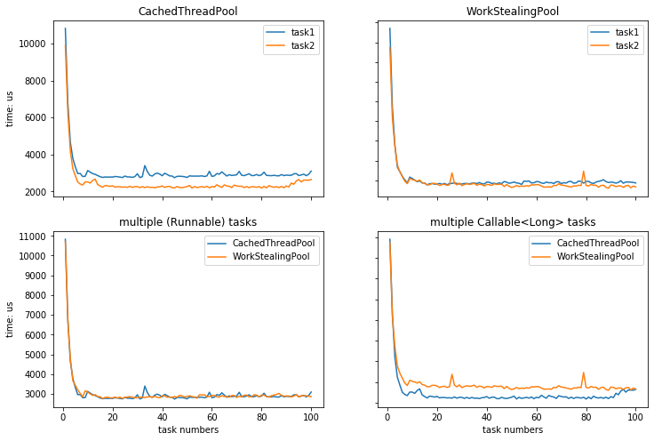

# Exercise 5.1

1. see result in "CachedThreadPool.txt"

2. see result in "WorkStealingPool.txt"

3. 

4. The result looks reasonable.

   * Consumed time decreases daramatily in the beginning and tend to be stable with slight fluctuation which is very similar to the result of explicit thread result, however, consumed time of multiple threads tend to increase in the end may because of increasement of thread's creation cost and reduce of each thread's computational cost. 
   * In cachedThreadPool, there is also a increasing trend of task2(multi callable tasks), it may be because the task2 invoke the tasks at the same time and there might be the situations that several threads are waiting to get task from the queue.

   * It shows that program will run faster when the number threads is multiple of number of cores.

5. LongAdder makes task 1 run faster no remakale changes in task2, as task 2 uses a local counter for each task.


# Exercise 5.3

1.  

   ```
   <!DOCTYPE html>
   <html lang="mul" class="no-js">
   <head>
   <meta charset="utf-8">
   <title>Wikipedia</title>
   <meta name="description" content="Wikipedia is a free online encyclopedia, created and edited by volunteers around the world and hosted by the Wikimedia Foundation.">
   <![if gt IE 7]>
   <script>
   document.documentElement.className = document.documentElement.className.replace( /(^|\s)no-js(\s|$)/, "$1js-enabled$2" );
   </script>
   ```

2.  Result :

    http://www.itu.dk : 227
   http://www.di.ku.dk : 263
   http://www.miele.de : 145
   http://www.ku.dk : 261
   http://www.sspai.com : 178
   http://www.ubi.com : 147
   http://www.douban.com : 155
   http://www.weibo.com : 268
   http://www.google.com : 13599
   http://www.bilibili.com : 270
   http://www.dtu.dk : 133
   http://www.stackoverflow.com : 150
   http://www.bbc.co.uk : 171
   http://www.steamcommunity.com : 147
   http://www.sony.co.jp : 231
   http://www.linecorp.com : 147
   http://www.battle.net : 228
   http://www.heise.de : 155
   http://www.wsj.com : 176
   http://www.bbc.co.uk : 171
   http://www.dsb.dk : 227
   http://www.bmw.com : 241
   https://www.cia.gov : 9067

   ```java
   public static void main(String[] args) throws IOException {
     Map<String, String> pagesMap = getPages(urls,200);
     Stream.of(urls).map(url -> url+" : "+pagesMap.get(url).length())
       .forEach(System.out::println);
   }
   
   public static Map<String,String> getPages(String[] urls, int maxLines) throws IOException {
     Map<String,String> result = new HashMap<>();
     for(String url: urls){
       BufferedReader in
         = new BufferedReader(new InputStreamReader(new URL(url).openStream())) ;
       StringBuilder sb = new StringBuilder();
       for (int i=0; i<maxLines; i++) {
         String inputLine = in.readLine();
         if (inputLine == null)
           break;
         else
           sb.append(inputLine).append("\n");
       }
       result.put(url,sb.toString());
     }
     return result;
   }
   ```

3.   time consumption:  4.46972324 ± 0.94437066

4.  time consumption:  1.5117286178 ± 0.8744916

   getPagesParallel is faster than getPages, but mot 23 times faster

   Firstly, create and start a new thread cost time. Secondly, submitting all tasks to a thread pool dooesn't mean all tasks will be processed at the same time.

   ```java
   public static Map<String,String> getPagesParallel(String[] urls, int maxLines) throws IOException {
     final Map<String,String> result = new HashMap<>();
     List<Callable<UrlContent>> tasks = new ArrayList<Callable<UrlContent>>();
     for(String _url:urls){
       final String url = _url;
       tasks.add(()->{
         UrlContent uc = new UrlContent(url);
         BufferedReader in
           = new BufferedReader(new InputStreamReader(new URL(url).openStream())) ;
         StringBuilder sb = new StringBuilder();
         for (int i=0; i<maxLines; i++) {
           String inputLine = in.readLine();
           if (inputLine == null)
             break;
           else
             sb.append(inputLine).append("\n");
         }
         uc.setContent(sb.toString());
         return  uc;
       });
     }
     try {
       List<Future<UrlContent>> futures = executor.invokeAll(tasks);
       for (Future<UrlContent> fut : futures)
         result.put(fut.get().url,fut.get().content);
     } catch (InterruptedException exn) {
       System.out.println("Interrupted: " + exn);
     } catch (ExecutionException exn) {
       throw new RuntimeException(exn.getCause());
     }
     return result;
   }
   ```

   

# Exercise 5.4

1.  result

   ```
   http://www.itu.dk links to https://www.itu.dk/
   http://www.di.ku.dk links to https://di.ku.dk/
   http://www.ku.dk links to https://www.ku.dk/
   http://www.google.com links to http://www.google.dk/history/optout?hl=da
   http://www.google.com links to /advanced_search?hl=da&amp;authuser=0
   http://www.google.com links to /language_tools?hl=da&amp;authuser=0
   http://www.google.com links to http://www.google.com/setprefs?sig=0_Zm_AW_hWGb4nwFKNq3D2JnNJJY0%3D&amp;hl=fo&amp;source=homepage&amp;sa=X&amp;ved=0ahUKEwjywPHTy_PkAhXClIsKHaCACiAQ2ZgBCAU
   http://www.google.com links to /intl/da/ads/
   http://www.google.com links to http://www.google.dk/intl/da/services/
   http://www.google.com links to /intl/da/about.html
   http://www.google.com links to http://www.google.com/setprefdomain?prefdom=DK&amp;prev=http://www.google.dk/&amp;sig=K_-dlicRNGgAsitHqWxXEhALd9xRw%3D
   http://www.google.com links to /intl/da/policies/privacy/
   http://www.google.com links to /intl/da/policies/terms/
   http://www.dtu.dk links to https://www.dtu.dk/
   ```

   

2. class Uniquifier<T> 

   ```java
   class UniQuifier<T> implements Runnable{
     private final BlockingQueue<T> input;
     private final BlockingQueue<T> output;
     private final Set<T> record = new HashSet<T>();
   
     UniQuifier(BlockingQueue<T> input, BlockingQueue<T> output) {
       this.input = input;
       this.output = output;
     }
   
     public void run() {
       while (true){
         T link = input.take();
         if (!record.contains(link)){
           record.add(link);
           output.put(link);
         }
       }
     }
   }
   ```

3. executor service

   ```java
   executor.submit(new UrlProducer(urls));
   executor.submit(new PageGetter(urls, pages));
   executor.submit(new LinkScanner(pages, refPairs));
   executor.submit(new UniQuifier<Link>(refPairs,uniPairs));
   executor.submit(new LinkPrinter(uniPairs));
   //The results are the same as when using threads
   ```

4. FixedThreadPool of size 6 got the same result as before

5. There is no print messages, it may be because the first 3 tasks occupy the threads in the thread pool as them run forever. The left two tasks haven't been executed at all

6. same result in different order

   It's because two UrlProducers works concurrently and urls are put in the `BlockingQueue urls` in different order

   